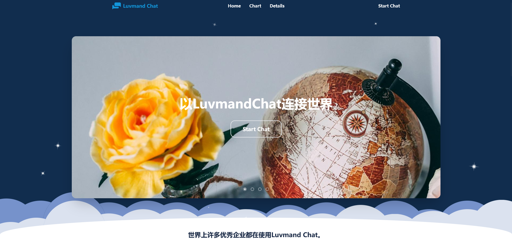
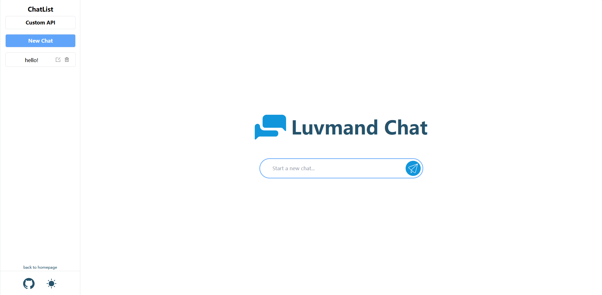

焦糖前端招新：OpenJT

此文档用于记录项目中的重难点。

# 项目设计

项目演示网站（需代理）：[Luvmand Chat (luvmand-chat-gptroom.vercel.app)](https://luvmand-chat-gptroom.vercel.app/)

本项目使用Vue3+Vite+Type Script搭建，样式主要使用Tailwind CSS完成，通过Vercel部署。通过vuerouter将不同题目分配在不同路由中（无法按照题号划分文件请见谅）。

github仓库：[arigreat/luvmandChat_gptroom (github.com)](https://github.com/arigreat/luvmandChat_gptroom)

# 题目一：官方宣传网站



**顶部导航栏**

- 中间通过a标签超链接绑定元素id进行页面内定位
- 右侧`Start Chat`通过`vuerouter`的`routerlink`跳转到题目二三的聊天界面
- `addEventListener('wheel',...)`监听滑动，向上滑收起导航栏，向下滑固定在顶部

**动画效果**

- 首页背景自动随机生成不同大小星星并进行闪烁动画
- `addEventListener('mousemovel',...)`监听鼠标移动，通过canvas画出跟随鼠标移动的特效

**轮播图**

- `Home`页面实现循环轮播图，并附有文字和连接
- `Chart`页面有两段弹幕循环轮播图

- `Details`页面通过transfrom和perspective实现3d轮播效果

**图表**

- 通过`echarts`实现两张用户图表

## canvas实现鼠标动画

[使用 canvas 来绘制图形 - Web API | MDN (mozilla.org)](https://developer.mozilla.org/zh-CN/docs/Web/API/Canvas_API/Tutorial/Drawing_shapes)

初始化:

```ts
// 获取canvas元素  
const canvas = <HTMLCanvasElement>document.querySelector('#canvasMouse')
// 获取指定类型的绘图方法属性
const ctx = <CanvasRenderingContext2D>canvas.getContext("2d")
```

基本操作：

```ts
ctx.fillStyle = "red"; // 填充样式
ctx.fillRect(10, 10, 100, 100); // 绘制矩形

// 设置边框样式
ctx.strokeStyle = "blue";
ctx.lineWidth = 5;

ctx.strokeRect(20, 20, 50, 50); // 绘制边框矩形

ctx.save(); // 保存上一次使用的所有方法和属性

// 绘制文本
ctx.font = "20px Arial";
ctx.fillStyle = "black";
ctx.fillText("123", 10, 150);

ctx.restore(); // 回到上一次save的状态

ctx.beginPath() // 新建一条画图路径
ctx.arc(75, 75, 50, 0, Math.PI * 2, true);// 绘制曲线
ctx.moveTo(110, 75); // 移动笔到指定位置（不画图）
ctx.lineTo(75, 25); // 绘制直线

ctx.stroke();// 绘制图形轮廓
ctx.fill();// 填充图形生成实心图形

ctx.path();// 连接回beginPath的起点处，闭合图形（非必须使用）
```


代码演示：

```ts
// canvas初始化
const canvas = <HTMLCanvasElement>document.querySelector('#canvasMouse')
const ctx = <CanvasRenderingContext2D>canvas.getContext("2d")
// 设置数组放置小球
let ballSets:Ball[] = []
// 定义小球class
class Ball{
    public x:number
    public y:number
    public round:number
    public color:string
    // 初始化
    constructor(x:number,y:number,round:number){
      this.x = x
      this.y = y
      this.round = round
      this.color = this.randomColor()
    }
    //随机颜色
    private randomColor():string{
    const colorType = [0,1,2,3,4,5,6,7,8,9,'a','b','c','d','e','f']
    let color:string = '#'
    for(let i = 0;i<6; i++){
      color += colorType[Math.floor(Math.random()*colorType.length)]
    }
    return color
    }
    // 绘制小球
    public drawBall(){
      ctx.beginPath() // 绘制起点
      ctx.arc(this.x,this.y,this.round,0,Math.PI*2,false) // 绘制圆形
      ctx.fillStyle = this.color; // 填充颜色
      ctx.fill() // 填充
    }
    // 重新绘图后更新小球位置大小
    public updateBall(){
      this.x += 0.5
      this.y += 0.5
      this.round -= 0.5
    }
}
// 初始化并添加小球至数组中
function ballInit(x:number,y:number){
const ball = new Ball(x,y,10)
ballSets.push(ball)
}
// 定时重绘小球数组中的内容
setInterval(()=>{
ctx.clearRect(0,0,canvas.width,canvas.height)
if(ballSets.length)
{
  ballSets = ballSets.filter((ball=>(ball.round>0)))
  ballSets.forEach((ball)=>{ball.updateBall();ball.drawBall();})
}
},15)
// addEventListener监听鼠标位置，添加小球
let isAddBall = false
addEventListener("mousemove",(e)=>{
if(isAddBall){return}
isAddBall = true
setTimeout(() => {
  ballInit(e.clientX,e.clientY) // client定位鼠标相对浏览器的位置 offset定位鼠标相对元素的位置 page定位鼠标相对页面的位置
  isAddBall = false
}, 25); 
})
```

# 题目二-三：GPT交互网页



**api调用实现完整对话**

- 使用openai官方库实现完整ai对话功能
- 采用流式输出
- 通过记录先前聊天内容实现整体记忆

**多个对话**

- 通过vuerouter动态路由为不同聊天分配不同地址

**个性化调整**

- 用户可自定义apikey，并实现切换模型的功能（如果key支持）
- 设置深色模式，可以手动/自动调整
- 尺寸自适应，包括移动端适配

**本地储存**

- localstorage保存/删除历史对话、路由地址、个性化设置等功能

## http调用

**基于openai库实现的基本调用请求：**

```typescript
const clientDefault = new OpenAI({
    apiKey:"api",
    baseURL:"url",
    dangerouslyAllowBrowser: true,
});

export interface gptMessage{
    massages:{
    role: 'user' | 'assistant';
    content: string;
	},
    time:number,
}

export interface chatElement{
    id:number,
    title:string,
    conversation:gptMessage[]
}

export async function chatgptRequest(userContent:chatElement)
{
	// 添加历史记录至请求
    let conversationHistory:Message[] = userContent.conversation.map(item => item.massages)
    const chatCompletions = await clientDefault.chat.completions.create({
        messages:conversationHistory,
        model:'gpt-3.5-turbo',
    });
    return chatCompletions;
}
```

**修改为axios POST形式：**

```typescript
export async function chatgptRequest(userContent: chatElement) {
    // 添加历史记录至请求
    let conversationHistory: Message[] = userContent.conversation.map(item => item.messages);
    // 添加请求数据
    const requestData = {
        model: 'gpt-3.5-turbo',
        messages: conversationHistory,
    };
    try {
        // post请求并设置请求头
        const response = await axios.post('https://api.openai.com/v1/chat/completions', requestData, {
            headers: {
                'Authorization': 'APIKey',
                'Content-Type': 'application/json',
            },
        });
        return response.data; 
    } catch (error) {
        console.error(error);
    }
}
```

**使用流式输出并处理接收数据：**

```typescript
//gpt.ts
export async function chatgptRequestStreammode(userContent:chatElement,localAPI:apiInitOptionalElement)
{
    let conversationHistory:Message[] = userContent.conversation.map(item => item.massages)
    // 判断是否使用用户自定义api
    if(localAPI.useDefault)
    {
        return clientDefault.chat.completions.create({
            messages:conversationHistory,
            model:'gpt-3.5-turbo',
            stream:true
        });
    }
    else{
        const clientUser = new OpenAI({
            apiKey:localAPI.apiKey,
            baseURL:localAPI.baseURL,
            dangerouslyAllowBrowser:true
        })
        return clientUser.chat.completions.create({
            messages:conversationHistory,
            model:localAPI.model||'gpt-3.5-turbo',
            stream:true
        });
    }
}

// chatViewChild.vue
async function sendMsgStream(){
    const sendingTime:number = new Date().getTime()
    const sendingMsg:string = input.value
    input.value = ""
    const msgSend:gptMessage = {time:sendingTime,massages:{role:"user",content:sendingMsg}}
    
    userParams.msgStorage.conversation.push(msgSend)

    const msgReceiving:gptMessage = {time:sendingTime,massages:{role:"assistant",content:''}}
    userParams.msgStorage.conversation.push(msgReceiving)
    try{
        // 接收gpt信息并存储
        const response = await gpt.chatgptRequestStreammode(userParams.msgStorage,apiGet())
        const receivedTime:number = new Date().getTime()
        let chunkTotal = []
        let contentTotal:string = ''
        userParams.msgStorage.conversation.pop()
        userParams.msgStorage.conversation.push({time:receivedTime,massages:{role:"assistant",content:''}})
        // 超时处理
        let isFinished = false
        const timeoutMaxtime = 3000
        const timeout = new Promise((resolve,reject)=>{setTimeout(() => {
            reject("timeout")
        }, timeoutMaxtime);}).catch((err)=>{
            if(!isFinished)
            {
                console.log(err)
                // gpt显示超时错误
                userParams.msgStorage.conversation[userParams.msgStorage.conversation.length-1].massages.content +="[time out, please try later]" 
            }
            return
        })
		// Promise.race比较两个promise的完成时间并返回更快的一个
        await Promise.race([response,timeout])
        for await(const chunk of response)
        {
            chunkTotal.push(chunk)
            if(chunk.choices.length > 0)
            {
                console.log(chunk.choices[0]?.delta?.content)
                contentTotal+=chunk.choices[0]?.delta?.content || ""
                userParams.msgStorage.conversation[userParams.msgStorage.conversation.length-1].massages.content = contentTotal
                // 流式传输停止后标记完成
                if(chunk.choices[0]?.finish_reason == "stop")
                {
                    isFinished = true
                }
            }
        }catch(err){
        // 捕获其他错误
        console.log(err)
        userParams.msgStorage.conversation[userParams.msgStorage.conversation.length-1].massages.content +="[something wrong happened, please try later]" 
    }
    // 存储更新聊天记录
    localStorage.setItem("chatListSets",JSON.stringify(chatListSets))
}
```


## vue-router

动态路由分配：

```typescript
const router = createRouter({
  history: createWebHistory(import.meta.env.BASE_URL),
  routes: [
    {
      path: '/',
      name: 'home',
      component: HomeView,
    },
    {
      path: '/chat',
      component: () => import('../views/ChatView.vue'),
      props:true,
      // 定义子路由
      children:[
        {
              // 子路由无id，定位至/chat/0
              path:'',
              redirect:{name:'chatid',params:{id:'0'}},
        },
    	{
              // 子路由分配动态路由，通过传参传入动态id值，确定对应聊天
              path:':id',
              name:'chatid',
              props:true,
              component:ChatChlidView
    	},]
    }
  ]
})

// ChatChildView.vue接收相关参数
const route = useRoute()
let chatListSets = JSON.parse(localStorage.getItem("chatListSets")||"")
const userParams = reactive({
    id:Number(route.params.id),
    autoChatContent:Number(route.query.startchat),
    msgStorage:chatListSets.find((chat:{id:number}) => chat.id === Number(route.params.id))||''
})
```

